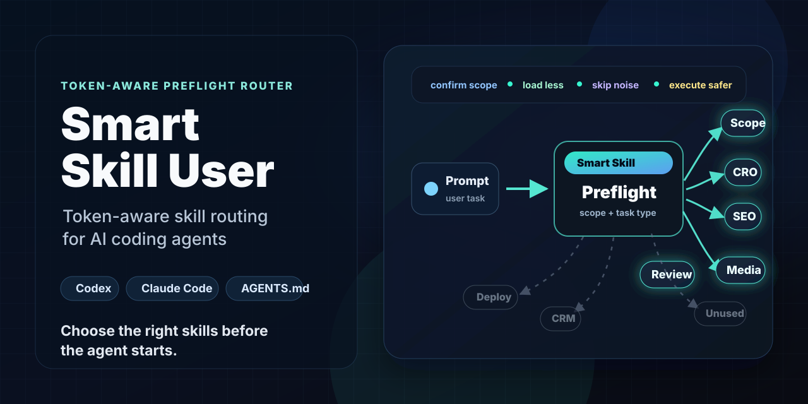

# Smart Skill User

**Stop loading every instruction. Start with the right ones.**

[](.github/workflows/ci.yml)
[](LICENSE)



**Automatically choose the best skill or best skill stack before your AI coding agent starts.**

Smart Skill User automatically chooses the best skill or smallest effective skill stack before your AI coding agent starts work. It gives Codex, Claude Code, and AGENTS.md-style workflows a token-aware preflight: confirm scope, classify the task, score available skills by relevance, choose one skill when one is enough or a stack when the task needs more, enforce approval gates, and avoid loading the entire instruction universe into context.

## Why This Exists

AI coding agents are powerful, but many repositories now contain layered instructions, skills, templates, client notes, deployment rules, and workflow docs. Loading all of it by default wastes context and increases the chance of wrong-repo, wrong-client, or wrong-tool drift.

Smart Skill User turns that messy first minute into a repeatable preflight that routes each task to the right skill stack before execution begins.

## The Problem

- Agents load too many instructions before they know the task.
- Agents often need one excellent skill, not a pile of unrelated ones.
- Long-running repos accumulate stale or unrelated guidance.
- Multi-client workspaces make wrong-scope edits easier.
- Visual, cleanup, connector, and deploy tasks need different approval gates.
- Token waste makes agents slower and less focused.

## What It Does

Smart Skill User asks an agent to start every task by reporting:

- confirmed scope: repo, project/client, branch, page/service/module
- task type: UI, SEO, copy, media, connector, research, cleanup, deploy, validation, or docs
- selected route: the best single skill for narrow tasks, or the smallest effective skill stack for multi-part work
- relevance reason: why each selected skill belongs in the stack
- skipped skills: irrelevant skills explicitly skipped when skipping prevents wasted work
- approval gates: preview, backup patch, deploy approval, or secret-safety rules
- planned validation: the smallest checks that match the risk

## How It Works

1. Read only the preflight instruction.
2. Confirm the working scope.
3. Classify the request.
4. Score available skills by task relevance, risk, and validation needs.
5. Automatically choose the best skill or minimal skill stack.
6. Apply the selected skill stack as constraints, not as decoration.
7. Validate and report concisely.

```text
Preflight -> scope -> task type -> best skill stack -> safer execution
```

## Before And After

**User prompt**

> Update the mobile homepage hero.

**Without preflight**

The agent may read unrelated backend docs, deployment notes, database schemas, and old client context before touching the UI.

**With Smart Skill User**

```text
Scope: unclear: which repo/client/page?
Task type: UI/CRO
Selected route: visual-quality + CRO review + copy/local SEO
Why this stack: mobile UI work needs layout, conversion, and copy checks
Skipped: deployment, database, connector tools
Approval needed: yes, preview before commit
```

## Install: Codex Global

Use this when you want Smart Skill User available across your Codex workspaces.

```powershell
pwsh ./scripts/install-codex-global.ps1
```

```bash
bash ./scripts/install-codex-global.sh
```

Manual install:

1. Copy `skills/smart-skill-user/SKILL.md` to `$HOME/.agents/skills/smart-skill-user/SKILL.md`.
2. Add the guidance from `templates/global-codex-AGENTS.md` to `$HOME/.codex/AGENTS.md`.
3. Restart Codex.

See [install/codex-global.md](install/codex-global.md).

## Install: Repo-Level Codex

Use this when a repository needs its own preflight rule.

1. Copy `skills/smart-skill-user/` to `.agents/skills/smart-skill-user/`.
2. Add the block from `templates/AGENTS.md` to the repo `AGENTS.md`.
3. Ask Codex to run Smart Skill Preflight before work.

See [install/codex-repo.md](install/codex-repo.md).

## Install: Claude Code

Smart Skill User is portable to Claude Code through `CLAUDE.md`. This repo does not claim native Claude skill support; it provides a compatible instruction pack.

Copy the relevant parts of [templates/CLAUDE.md](templates/CLAUDE.md) into your project `CLAUDE.md`.

See [install/claude-code.md](install/claude-code.md).

## Install: Generic AGENTS.md

For any agent that reads `AGENTS.md`, copy the preflight from [templates/smart-skill-preflight.md](templates/smart-skill-preflight.md) into your repository guidance.

See [install/generic-agents-md.md](install/generic-agents-md.md).

## Examples

- [Mobile hero task](examples/mobile-hero-task.md)
- [SEO schema task](examples/seo-schema-task.md)
- [Media and video task](examples/media-video-task.md)
- [Cleanup or revert task](examples/cleanup-revert-task.md)
- [Deployment task](examples/deployment-task.md)
- [Wrong-scope task](examples/wrong-scope-task.md)

## Routing Matrix Preview

| Task | Best skill or stack | Skip | Gate |
| --- | --- | --- | --- |
| Mobile hero | visual + CRO + copy | deployment, database | preview before commit |
| SEO schema | schema + source-truth + copy | deploy, media | no fake claims |
| Media/video | media extraction + asset policy | database, CRM | no hotlinking |
| Cleanup/revert | review + backup + validation | visual unless affected | backup patch first |
| Deploy/release | release + CI + hosting | unrelated docs | explicit approval |

See [docs/skill-routing-matrix.md](docs/skill-routing-matrix.md).

## Safety Model

Smart Skill User does not make changes safer by magic. It makes the agent pause long enough to choose the right safety rule:

- visual/CRO: preview before commit
- deploy/publish/DNS/CRM: explicit approval
- cleanup/revert/destructive work: backup patch first
- secrets/private data: never expose
- unclear scope: stop and ask

See [docs/safety-and-approval-gates.md](docs/safety-and-approval-gates.md).

## Token-Efficiency Model

The goal is not to minimize context at all costs. The goal is to spend context only after the task is understood.

Smart Skill User favors:

- targeted searches over broad file reads
- the best skill or smallest effective skill stack over every skill doc
- current repo state over old chat history
- bounded validation over unnecessary renders or live tools

See [docs/token-efficiency.md](docs/token-efficiency.md).

## Limitations

- It is an instruction workflow, not a permissions sandbox.
- It cannot prevent a tool from running if your agent ignores instructions.
- It depends on clear repo guidance and honest scope reporting.
- It does not replace tests, code review, or deployment controls.
- Claude Code support is provided through portable instructions, not native skill packaging.

## Roadmap

- More routing examples for backend, data, and security tasks
- Optional repo scanner for skill inventory summaries
- More install helpers for team templates
- Example pull request showing a before/after agent workflow

## Launch Copy

**Short X post**

Stop loading every instruction into your AI coding agent.

Smart Skill User is a tiny preflight workflow for Codex, Claude Code, and AGENTS.md agents: confirm scope, classify the task, automatically choose the best skill or minimal skill stack, and enforce approval gates before work starts.

**LinkedIn post**

AI coding agents need better first steps. Smart Skill User is a lightweight, open-source preflight workflow for Codex, Claude Code, and AGENTS.md-compatible agents. It helps agents confirm scope, identify task type, automatically choose the best skill or smallest effective skill stack, and apply safety gates for visual work, cleanup, connectors, and deploys.

It is intentionally small: one skill, install templates, examples, validation tests, and docs for teams that want less context waste and fewer wrong-scope edits.

**Reddit/Hacker News style post**

I made a small open-source workflow called Smart Skill User. It is a token-aware preflight router for AI coding agents. The idea is simple: before an agent reads half your repo docs, it should confirm scope, classify the task, automatically pick the best skill or minimal skill stack, and identify approval gates.

It supports Codex skill installs, repo-level AGENTS.md, Claude Code instructions, and generic agent workflows. Feedback welcome, especially from people maintaining multi-project AI coding setups.

**GitHub repo description**

Token-aware skill routing for Codex, Claude Code, and AGENTS.md coding agents.

**SEO keywords**

Codex skills, Claude Code instructions, AGENTS.md, AI coding agents, agent skills, prompt engineering, token optimization, developer workflow automation, coding agent safety.

## Contributing

Contributions are welcome. Please read [CONTRIBUTING.md](CONTRIBUTING.md), keep examples generic, and avoid adding private customer or workspace data.

## License

MIT. See [LICENSE](LICENSE).
